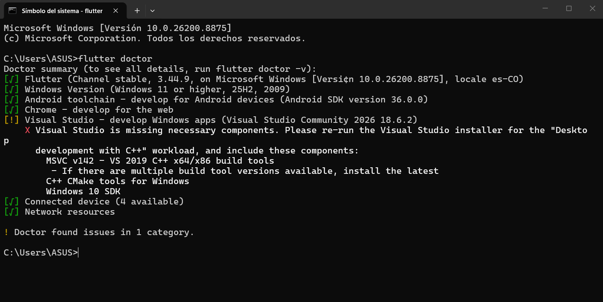

# flutter_application_1

Aplicación Flutter para la gestión y consulta de cultivos registrados dentro de una finca.

El proyecto implementa un dominio tipado para representar los cultivos, sus períodos y estados, y actualmente obtiene los datos desde un archivo JSON local mediante una interfaz de repositorio.

## Getting Started

A new Flutter project.

A few resources to get you started if this is your first Flutter project:

- [Learn Flutter](https://docs.flutter.dev/get-started/learn-flutter)
- [Write your first Flutter app](https://docs.flutter.dev/get-started/learn-flutter)
- [Write your first Flutter app](https://docs.flutter.dev/get-started/codelab)
- [Flutter learning resources](https://docs.flutter.dev/reference/learning-resources)

For help getting started with Flutter development, view the
[online documentation](https://docs.flutter.dev/), which offers tutorials,
samples, guidance on mobile development, and a full API reference.

## Flutter doctor screenshot



## El dominio

### Crop

`Crop` es la entidad principal del dominio. Su identidad está determinada por `id`.

Contiene:

- `id`
- `name`
- `cropType`
- `period`
- `state`
- `responsibleId`

### CropPeriod

`CropPeriod` es un objeto de valor que representa el período del cultivo:

- Fecha de siembra, que puede ser opcional.
- Fecha estimada de cosecha.

También valida que la fecha de siembra no sea posterior a la fecha estimada de cosecha.

### CropState

`CropState` representa el estado actual del ciclo de vida de un cultivo.

Los estados implementados son:

- `Planned`
- `Growing`
- `Harvested`

Cada estado contiene únicamente la información correspondiente a esa etapa.

## Persistencia local

Los cultivos se almacenan actualmente en:

`assets/data/crops.json`

La aplicación utiliza `CropsLocal` para leer y convertir el JSON en objetos `Crop`.

`CropsLocal` implementa la interfaz `CropsRepository`, definida en el dominio.

Esta separación permite cambiar posteriormente la fuente de datos, por ejemplo por Firestore, sin modificar el resto de la aplicación.

El lector del asset se inyecta mediante el constructor de `CropsLocal`, lo que permite realizar pruebas sin depender directamente del bundle de Flutter.

## Pruebas

El proyecto cuenta con pruebas para:

- Serialización y deserialización de `Crop`.
- Igualdad y `hashCode`.
- `copyWith`.
- Reglas de negocio.
- Lectura del repositorio local.
- Búsqueda de cultivos por `id`.
- Validación de archivos JSON.
- Lectura del asset real.

Las pruebas se ejecutan mediante:

```bash
flutter test
```

## Freezed

Decisión sobre Freezed: Se utiliza Freezed para generar automáticamente la igualdad, `hashCode`, `toString` y `copyWith` de la entidad `Crop`, reduciendo código repetitivo y evitando errores manuales.

Se mantiene `fromJson` implementado manualmente para conservar los mensajes de validación específicos mediante `InvalidField`. La deserialización manual permite identificar exactamente qué campo del JSON es inválido.

Los archivos generados por Freezed se incluyen en el repositorio.

## Cómo ejecutar el proyecto

### 1. Instalar las dependencias

Desde la carpeta raíz del proyecto, ejecutar:

```bash
flutter pub get
```

### 2. Ejecutar las pruebas

Para verificar que todas las pruebas del proyecto funcionan correctamente:

```bash
flutter test
```

### 3. Analizar el código

Para comprobar que no existen errores ni problemas detectados por el analizador de Dart:

```bash
flutter analyze
```

### 4. Ejecutar la aplicación

Para iniciar la aplicación en un dispositivo físico o emulador:

```bash
flutter run
```

### 5. Generar nuevamente los archivos de Freezed

Si se realizan cambios en las clases que utilizan Freezed, regenerar los archivos correspondientes con:

```bash
dart run build_runner build --delete-conflicting-outputs
```

Durante el desarrollo también se puede utilizar el modo observador:

```bash
dart run build_runner watch --delete-conflicting-outputs
```

> Los archivos generados por Freezed se incluyen en el repositorio, por lo que no es necesario ejecutar `build_runner` para simplemente clonar y ejecutar el proyecto.

## Integración continua

El proyecto utiliza GitHub Actions para ejecutar automáticamente:

- `dart format`
- `flutter analyze`
- `flutter test`

El flujo de CI se ejecuta en cada `push` y `pull request`.
